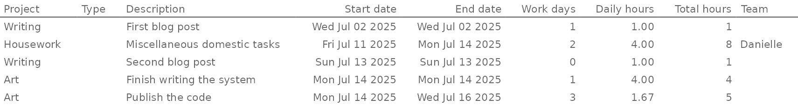
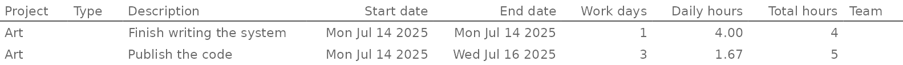
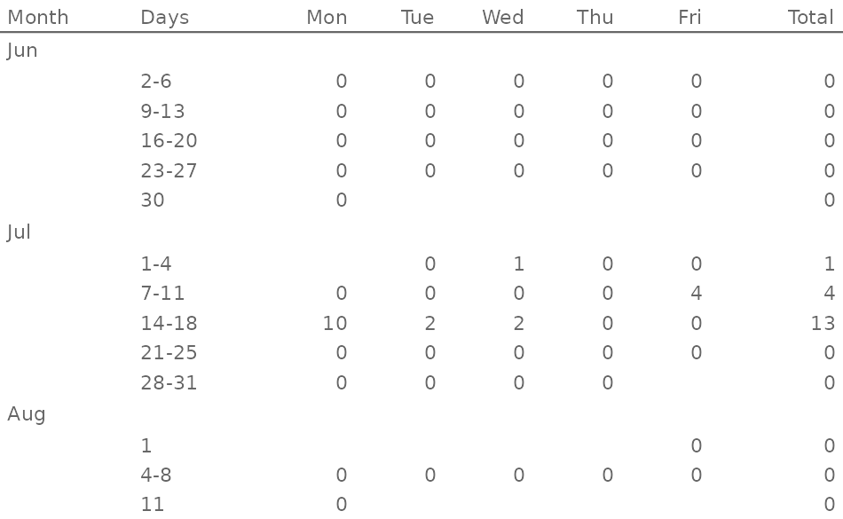

<!-- README.md is generated from README.Rmd. Please edit that file -->

# calendario

<!-- badges: start -->

[](https://lifecycle.r-lib.org/articles/stages.html#experimental)
[](https://CRAN.R-project.org/package=calendario)
<!-- badges: end -->

Personal package to help me track my tasks. Unlikely to be of value to
anyone else.

## Installation

You can install the development version of calendario like so:

``` r
pak::pak("djnavarro/calendario")
```

## Example

Creating a calendar and adding tasks to projects:

``` r
library(calendario)

# initialise an empty calendar
cal <- cal_new()
cal
#> <Calendario object [0 projects]>

# this is the verbose way to add a task
cal$add_task(
  description = "Miscellaneous domestic tasks",
  start = as.Date("2025-07-11"),
  stop = as.Date("2025-07-14"),
  project = "Housework",
  daily_hours = 4,
  team  = "Danielle"
)
cal
#> <Calendario object [1 project]>
#> • Housework [1 task]

# this is a more convenient way
cal$set_project("Art")
cal$add_task("Finish writing the system", "14 jul", total_hours = 4)
cal$add_task("Publish the code", "14 jul", "16 jul", total_hours = 5)
cal
#> <Calendario object [2 projects]>
#> • Art [2 tasks]
#> • Housework [1 task]

# piping is also supported
cal |>
  cal_set_project("Writing") |>
  cal_add_task("First blog post", "2 jul") |>
  cal_add_task("Second blog post", "13 jul")
cal 
#> <Calendario object [3 projects]>
#> • Art [2 tasks]
#> • Housework [1 task]
#> • Writing [2 tasks]
```

Viewing tasks, projects, and monthly calendars at the R console:

``` r
# one row per task, all details shown
cal$get_tasks()
#> # A tibble: 5 × 9
#>   project type  description start      stop        days daily_hours total_hours
#>   <chr>   <chr> <chr>       <date>     <date>     <int>       <dbl>       <dbl>
#> 1 Housew… <NA>  Miscellane… 2025-07-11 2025-07-14     2        4              8
#> 2 Art     <NA>  Finish wri… 2025-07-14 2025-07-14     1        4              4
#> 3 Art     <NA>  Publish th… 2025-07-14 2025-07-16     3        1.67           5
#> 4 Writing <NA>  First blog… 2025-07-02 2025-07-02     1        1              1
#> 5 Writing <NA>  Second blo… 2025-07-13 2025-07-13     0        1              1
#> # ℹ 1 more variable: team <chr>

# one tibble per month, counts daily hours
cal$get_calendar("1 jun", "11 aug")
#> [[1]]
#> # A tibble: 5 × 8
#>   Month Days    Mon   Tue   Wed   Thu   Fri Total
#>   <ord> <chr> <dbl> <dbl> <dbl> <dbl> <dbl> <dbl>
#> 1 Jun   2-6       0     0     0     0     0     0
#> 2 Jun   9-13      0     0     0     0     0     0
#> 3 Jun   16-20     0     0     0     0     0     0
#> 4 Jun   23-27     0     0     0     0     0     0
#> 5 Jun   30        0    NA    NA    NA    NA     0
#> 
#> [[2]]
#> # A tibble: 5 × 8
#>   Month Days    Mon   Tue   Wed   Thu   Fri Total
#>   <ord> <chr> <dbl> <dbl> <dbl> <dbl> <dbl> <dbl>
#> 1 Jul   1-4   NA     0     1        0     0     1
#> 2 Jul   7-11   0     0     0        0     4     4
#> 3 Jul   14-18  9.67  1.67  1.67     0     0    13
#> 4 Jul   21-25  0     0     0        0     0     0
#> 5 Jul   28-31  0     0     0        0    NA     0
#> 
#> [[3]]
#> # A tibble: 3 × 8
#>   Month Days    Mon   Tue   Wed   Thu   Fri Total
#>   <ord> <chr> <dbl> <dbl> <dbl> <dbl> <dbl> <dbl>
#> 1 Aug   1        NA    NA    NA    NA     0     0
#> 2 Aug   4-8       0     0     0     0     0     0
#> 3 Aug   11        0    NA    NA    NA    NA     0
```

Creating HTML tables to display the tasks:

``` r
cal$show_tasks()
```



Tasks can be filtered:

``` r
cal$show_tasks(project == "Art")
```



Calendars can also be displayed as HTML tables:

``` r
cal$show_calendar("1 jun", "11 aug")
```


